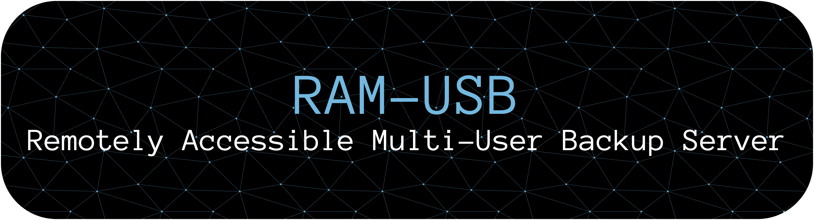

---

**R.A.M.-U.S.B.** is a geo-distributed, Remotely Accessible Multi-User Backup Server written in **Go**, designed with **zero-knowledge security principles** in mind. 

This project was designed by [**Francesco Verrengia**](https://github.com/Verryx-02) and [**Riccardo Gottardi**](https://github.com/Riccardo-Gottardi).  
Implemented by [**Francesco Verrengia**](https://github.com/Verryx-02) with [**Claude AI**](https://en.wikipedia.org/wiki/Claude_(language_model)) as part of academic work in the field of IoT and cybersecurity.  
The use of AI assistance was intentional to significantly accelerate development time and provide a case study on the capabilities and limitations of this technology in the sensitive field of cybersecurity.

We set out to build a secure, distributed backup infrastructure that ensures **privacy, resilience, and remote accessibility**, with user data protection as our highest priority.

---

## Key Features

- **Zero-Knowledge Design** — All user data is encrypted client-side; even we cannot access your files.
- **Geo-Distributed Architecture** — The system can run across multiple physical nodes for redundancy and load balancing.
- **Smart Access Control** — Only authenticated users can access storage nodes, using strict SFTP policies.
- **Multi-User Support** — Each user has an isolated environment and encryption keys.
- **Remote Access** — Users can perform secure backups and restores from anywhere in the world.
- **Modern Cryptography** — Argon2id for email and password hashing, AES for encryption.

---

## System Architecture

The system is composed of several distributed components:

- **Entry-Hub**: Exposes an HTTPS REST API created by us for initial user authentication.
- **Security-Switch**: Manages secure communication and access control between services using mutual TLS.
- **Database-Vault**: Stores credentials and user metadata, encrypted and isolated.
- **Storage-Service**: Handles encrypted file storage and retrieval.
- **Tailscale Mesh VPN**: Ensures secure, private communication across nodes without opening any public ports.

All communication between components is secured with **mutual TLS (mTLS)**.

See the [documentation](documentation/registration_flow.md) for more
If you are Professor Scagnetto, read [this guide](Understanding_RAM-USB.md)
--- 

## Project Structure

R.A.M.-U.S.B. implements a **distributed zero-trust architecture** with four main microservices communicating via mutual TLS (mTLS).  
Each component has specific security responsibilities in the authentication and storage pipeline.

```
.
├── LICENSE & README.md              # Project documentation
├── assets/                          # Project assets (banner, diagrams)
│
├── certificates/                    # PKI Infrastructure for mTLS
│   ├── certification-authority/     # Root CA for the entire system
│   ├── entry-hub/                   # Server + Client certificates for Entry-Hub
│   ├── security-switch/             # Server + Client certificates for Security-Switch  
│   ├── database-vault/              # Server + Client certificates for Database-Vault
│   └── storage-service/             # Server + Client certificates for Storage-Service
│
├── entry-hub/                      # Public HTTPS API Gateway
│   ├── handlers/                   # REST API endpoints (/api/register, /api/health)
│   ├── interfaces/                 # mTLS client for Security-Switch communication (entry-hub->security-switch)
│   ├── config/                     # Service configuration (Security-Switch IP, mTLS certificates)
│   ├── utils/                      # Input validation, HTTP helpers, JSON parsing, error handling
│   ├── types/                      # Data structures for API requests/responses (RegisterRequest, Response)
│   └── main.go                     # HTTPS server (port 8443)
│
├── security-switch/                # mTLS Security Gateway  
│   ├── handlers/                   # REST API endpoints (/api/register, /api/health) using defense-in-depth validation
│   ├── interfaces/                 # mTLS client for Database-Vault communication (security-switch->database-vault)
│   ├── config/                     # Service configuration (Database-Vault IP, mTLS certificates)
│   ├── utils/                      # Defense-in-depth validation, HTTP helpers, JSON parsing, error handling
│   ├── types/                      # Data structures for API requests/responses (RegisterRequest, Response)
│   ├── middleware/                 # mTLS authentication enforcement
│   └── main.go                     # mTLS server (port 8444)
│
├── database-vault/                 # Encrypted Credential Storage
│   ├── handlers/                   # User storage with AES-256-GCM encryption
│   ├── config/                     # Service configuration (database URL, encryption keys, mTLS certificates)
│   ├── database/                   # PostgreSQL Database Layer
│   │   ├── setup.sh                # Automated database setup script
│   │   ├── README.md               # Database documentation and setup guide
│   │   └── schema/                 # SQL Schema definitions
│   │       ├── 001_create_tables.sql        # Users table with encryption fields
│   │       ├── 002_create_indexes.sql       # Performance and security indexes
│   │       ├── 003_create_triggers.sql      # Automatic timestamp management
│   │       └── 004_create_constraints.sql   # Data validation constraints
│   ├── utils/                      # Final validation layer, HTTP helpers, JSON parsing, error handling
│   ├── types/                      # Data structures for storage operations (StoredUser, RegisterRequest, Response)
│   ├── crypto/                     # Argon2id hashing + AES-256-GCM encryption utilities
│   ├── storage/                    # Database interface definitions and implementations
│   │   ├── interface.go            # Storage interface definitions with security contracts
│   │   └── postgresql/             # PostgreSQL implementation
│   │       ├── postgresql.go       # Main implementation of UserStorage interface
│   │       ├── connection.go       # Connection pooling and database management  
│   │       ├── queries.go          # SQL query constants and prepared statements
│   │       └── errors.go           # PostgreSQL error mapping and categorization
│   ├── middleware/                 # mTLS authentication for Security-Switch
│   └── main.go                     # mTLS server (port 8445)
│
├── user-client/                    # Client
│   ├── registration/               # HTTPS client for registration flow
│   └── keys/                       # SSH keypair
│   └── main.go                     # Registration test client
│
├── documentation/                  # Technical Documentation
│   └── registration_flow.md        # Complete system flow and security model
│
└── scripts/                        # Setup & Deployment
    └── generate_key.sh             # Automated certificate generation script
```


### Architecture Overview

**Request Flow**: `Client → Entry-Hub → Security-Switch → Database-Vault`

1. **Entry-Hub**: Exposes public HTTPS API, performs initial validation, forwards via mTLS
2. **Security-Switch**: Acts as security checkpoint with defense-in-depth validation  
3. **Database-Vault**: Final storage layer with email encryption and password hashing
4. **Certificate Infrastructure**: Every service authenticates via mTLS using dedicated certificates

### Key Security Features

- **Zero-Trust Network**: All inter-service communication requires mutual TLS authentication
- **Defense-in-Depth**: Each layer re-validates input data independently  
- **Email Encryption**: AES-256-GCM with random salt prevents deterministic encryption
- **Password Security**: Argon2id hashing with cryptographic salt generation
- **Certificate-Based Authentication**: Each service validates client organization certificates

### Where to Start

- **Overall Architecture**: `documentation/registration_flow.md`
- **Certificate Setup**: `scripts/generate_key.sh` 
- **API Gateway**: `entry-hub/main.go` and `entry-hub/handlers/`
- **Security Model**: `security-switch/middleware/mtls.go`
- **Encryption Implementation**: `database-vault/crypto/`
- **Test the System**: `user-client/main.go`


## Getting Started

> ⚠️ This project is under active development and is not ready for production use. It has only been tested on macOS. It should work on Linux, but it has not been tested yet.

To test the registration process locally:

### Prerequisites

1. **Generate certificates:**
   ```bash
   cd scripts && ./generate_key.sh
   ```

2. **Connect to Tailscale private network:**
   ```bash
   # Install and connect to Tailscale
   tailscale up
   
   # Get your Tailscale IP address
   tailscale ip -4
   ```

3. **Configure Tailscale IP addresses:**
   
   Update the configuration files with your Tailscale IP address:
   
   **File: `entry-hub/config/config.go`**
   ```go
   // Replace with your Tailscale IP
   SecuritySwitchIP: "YOUR_TAILSCALE_IP:8444"
   ```
   
   **File: `security-switch/config/config.go`**
   ```go
   // Replace with your Tailscale IP  
   DatabaseVaultIP: "YOUR_TAILSCALE_IP:8445"
   ```
   
   **Example:**
   ```bash
   # If your Tailscale IP is 100.64.123.456
   SecuritySwitchIP: "100.64.123.456:8444"
   DatabaseVaultIP: "100.64.123.456:8445"
   ```

4. **Open 4 terminal tabs**

### Setup and Start Services (in order)

**TAB-1 (Database-Vault):**
```bash
cd database-vault
export RAMUSB_ENCRYPTION_KEY=$(openssl rand -hex 32)
go run .
```

**TAB-2 (Security-Switch):**
```bash
cd security-switch  
go run .
```

**TAB-3 (Entry-Hub):**
```bash
cd entry-hub
go run .
```

**TAB-4 (Test Client):**
```bash
cd user-client
go run .
```

### Expected Success Response
```json
{"success":true,"message":"User successfully registered!"}
```

⸻

Authors
	•	[**Francesco Verrengia**](https://github.com/Verryx-02)
	•	[**Riccardo Gottardi**](https://github.com/Riccardo-Gottardi)

⸻

License: [MIT](LICENSE)

⸻

Acknowledgments

Special thanks to the University of Udine, in particular to Professor Ivan Scagnetto, for supporting our research and experimentation on secure and distributed systems.