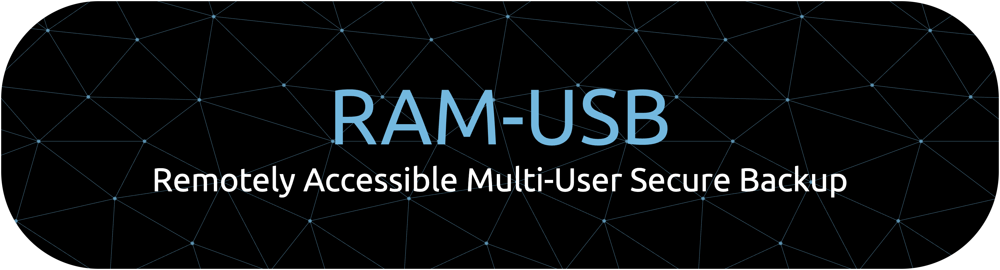

A multi-user, geo-distributed, remotely accessible backup service, designed around **zero-knowledge**, **zero-trust**, and **defense-in-depth** principles.

This is my Bachelor's degree thesis project in Computer Science at the **University of Udine**, supervised by [**Prof. Ivan Scagnetto**](https://users.dimi.uniud.it/~ivan.scagnetto/).

This project is designed by [Francesco Verrengia](https://github.com/Verryx-02) and [Riccardo Gottardi](https://github.com/Riccardo-Gottardi)

---
## About

RAM-USB is built as an in-depth case study on the secure design of distributed backup systems.   
For this thesis, design counts more than implementation: getting the architecture, the trust boundaries, and the data flows right is the actual goal.

The [Software Requirements Specification](https://github.com/Verryx-02/RAM-USB/blob/main/docs/Software_Requirements_Specification.md) is the single source of truth for what this system must do, and the [design diagrams](https://github.com/Verryx-02/RAM-USB/tree/main/docs/design/diagrams) show how every part fits together: use cases, architecture, data model, security, and operational flows, each rendered as an SVG you can open directly from the repo.

### Design principles

- **Zero-knowledge**: no server-side component can access backup file contents in plaintext.
- **Zero-trust**: no component implicitly trusts data received from another, even when mutually authenticated.
- **Defense-in-depth**: every layer independently re-validates input, regardless of upstream checks.

---

## Architecture

RAM-USB is an [n-tier client-server microservices architecture](https://en.wikipedia.org/wiki/Multitier_architecture) made up of 10 Docker containers, connected over a private [Headscale](https://github.com/juanfont/headscale) mesh VPN with [mTLS](https://en.wikipedia.org/wiki/Mutual_authentication) between every internal service.

| Component                                                                                                 | Role                                                                                                       | Status      |
| --------------------------------------------------------------------------------------------------------- | ---------------------------------------------------------------------------------------------------------- | ----------- |
| [User-Client](https://github.com/Verryx-02/RAM-USB/tree/main/user-client)                                 | CLI client: registers, authenticates, backs up/restores files via `restic` over SFTP                       | Not started |
| [Entry-Hub](https://github.com/Verryx-02/RAM-USB/tree/main/services/entry-hub)                            | Public-facing HTTPS gateway; validates and forwards requests                                               | Not started |
| [Security-Switch](https://github.com/Verryx-02/RAM-USB/tree/main/services/security-switch)                | Internal request router and re-validator                                                                   | Not started |
| [Database-Vault](https://github.com/Verryx-02/RAM-USB/tree/main/services/database-vault)                  | User data persistence (PostgreSQL), credential hashing/encryption                                          | Not started |
| [Storage-Service](https://github.com/Verryx-02/RAM-USB/tree/main/services/storage-service)                | Per-user isolated, chrooted SFTP storage for encrypted backups                                             | Not started |
| [Network-Manager](https://github.com/Verryx-02/RAM-USB/tree/main/services/network-manager)                | Headscale ACL and mesh access control                                                                      | Not started |
| [Mosquitto (MQTT broker)](https://github.com/Verryx-02/RAM-USB/tree/main/third-party/mosquitto)           | Metrics transport between services and the collector                                                       | Not started |
| [Metrics-Collector](https://github.com/Verryx-02/RAM-USB/tree/main/services/metrics-collector)            | Ingests and stores metrics (TimescaleDB)                                                                   | Not started |
| [Metrics-Visualizer (Grafana)](https://github.com/Verryx-02/RAM-USB/tree/main/third-party/grafana)        | Operational dashboards                                                                                     | Not started |
| [Certificate-Authority](https://github.com/Verryx-02/RAM-USB/tree/main/third-party/certificate-authority) | Issues and rotates mTLS certificates ([smallstep/certificates](https://github.com/smallstep/certificates)) | Not started |

---

## Tech stack

- **Language:** [Go](https://go.dev/)
- **Personal data persistence:** [PostgreSQL](https://www.postgresql.org/)
- **Metrics persistence:** [TimescaleDB](https://github.com/timescale/timescaledb)
- **Backup persistence:** [CephFS](https://ceph.io/) (target)
- **Networking:** [Headscale](https://github.com/juanfont/headscale)
- **Client-side compression, encryption and deduplication:** [restic](https://restic.net/)
- **Certificates:** [smallstep/certificates](https://github.com/smallstep/certificates) (private components), Let's Encrypt (public-facing endpoints)
- **Deployment:** Docker, [Proxmox VE](https://www.proxmox.com/proxmox-virtual-environment)

---

## Getting started (development)

> [!WARNING] The project is still in the design phase.
> There is no runnable code yet. 
> This section will be filled in as services are implemented.

```bash
git clone https://github.com/Verryx-02/RAM-USB.git
cd RAM-USB
```

(ONLY) Local development will run the full stack via:

```bash
docker compose -f deployments/docker-compose.dev.yml up
```

---

## Development process

This project follows:

- **Spiral model** for requirements: the SRS is refined iteratively across the versions
- **V-model** for implementation: tests are written before code (pre-testing, to validate that requirements are testable), and each level of specification has a corresponding level of testing.
- **Conventional Commits**, scoped by component and tagged with requirement IDs, for full bidirectional traceability between code and requirements.

---

## Use of AI assistance

Parts of the implementation are carried out with the help of [Claude Sonnet 5](https://www.anthropic.com/news/claude-sonnet-5), used strictly as an implementation tool under close supervision.

- **I** am responsible for: design, code structure, module boundaries, individual function signatures and behavior, and the corresponding tests.
- **Claude** implements exactly, and only, what I specify, in small, incremental steps, so that each change is small enough for me to fully verify before moving on.
- **No change is integrated into the codebase without my review and explicit approval.** Nothing generated is merged, committed, or trusted by default; every step is checked against the requirement it is meant to satisfy before it becomes part of the project.

## Documentation

- [Software Requirements Specification](https://github.com/Verryx-02/RAM-USB/blob/main/docs/Software_Requirements_Specification.md): full requirements, use cases, and known risks
- [Contributing guidelines](https://github.com/Verryx-02/RAM-USB/blob/main/CONTRIBUTING.md): commit conventions, branching model, workflow

---

## License

Distributed under the [MIT License](https://github.com/Verryx-02/RAM-USB/blob/main/LICENSE).

## Author

Francesco Verrengia, Riccardo Gottardi