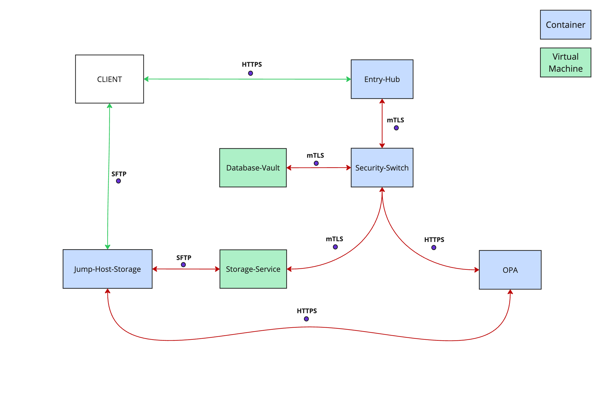

# Complete System Flow  
**Client → Entry-Hub → Security-Switch → Database-Vault**

1. Client sends HTTPS request to Entry-Hub  
2. Entry-Hub validates and forwards request via mTLS to Security-Switch  
3. Security-Switch validates (defense-in-depth) and forwards via mTLS to Database-Vault  
4. Database-Vault validates (defense-in-depth), encrypts, stores, and responds  
5. Response returns back:  
   `Database-Vault → Security-Switch → Entry-Hub → Client`

---

# Entry-Hub: Execution Flow

## STARTUP (`main.go`)

- **Load configuration:** HTTPS server certificates, mTLS client certs for Security-Switch  
- **Validate configuration:** check certificate files exist, validate cert/key pairs, test Security-Switch connectivity
- **Configure HTTPS server:** TLS server for external clients  
- **Configure mTLS client:** certificates for communicating with Security-Switch  
- **Start HTTPS server on port 8443:** accept TLS clients  

## CLIENT REQUEST HANDLING (`/api/register`)

- **Receive HTTPS request:** from external client (curl, app, etc.)  
- **Validate HTTP method:** accept **POST** only  
- **Read request body:** JSON with email, password, SSH key  
- **Parse JSON:** convert into `RegisterRequest` struct  

## ENTRY-LEVEL VALIDATION

- **Validate required fields:** email, password, SSH key present  
- **Validate email format:** RFC 5322 compliant  
- **Validate password length:** minimum 8 characters  
- **Check for weak passwords:** common password dictionary check  
- **Validate password complexity:** at least 3 character categories  
- **Validate SSH key format:** algorithm, encoding, wire format structure  

## FORWARD TO SECURITY-SWITCH

- **Initialize mTLS client:** certificates for Security-Switch  
- **Certificate validation:** verify Security-Switch certificate chain, check organization="SecuritySwitch"
- **Create mTLS request:** POST to Security-Switch `/api/register`  
- **Send via mTLS:** authenticated connection to Security-Switch  
- **Receive response:** success/error from Security-Switch  

## RESPONSE TO CLIENT

- **Log operation:** audit trail  
- **Forward response:** HTTP status + JSON message to original client  
- **Error handling:** HTTP 400 (validation), 401 (auth), 500 (internal), 502 (bad gateway), 503 (service unavailable)
- **Error categorization:** detailed logs vs sanitized client messages

---

# Security-Switch: Execution Flow

## STARTUP (`main.go`)

- **Load configuration:** mTLS server certificates, mTLS client certs for Database-Vault  
- **Validate configuration:** check certificate files exist, validate cert/key pairs.
- **Configure mTLS server:** accept only authenticated Entry-Hub connections  
- **Configure mTLS client:** certificates for communicating with Database-Vault  
- **Start mTLS server on port 8444:** certificate-only connections  

## ENTRY-HUB REQUEST HANDLING (`/api/register`)

- Verify mTLS: check Entry-Hub certificate (middleware)  
- **Certificate validation:** verify certificate chain, CA validation, check organization = "EntryHub"
- **Authentication logging:** log successful/failed authentication attempts with certificate details
- **Validate HTTP method:** accept **POST** only  
- **Read request body:** JSON with email, password, SSH key  
- **Parse JSON:** convert into `RegisterRequest` struct  

## DEFENSE-IN-DEPTH VALIDATION

- **Validate required fields:** email, password, SSH key present  
- **Validate email format:** RFC 5322 + security checks  
- **Validate password length:** minimum 8 characters  
- **Check for weak passwords:** common password dictionary check  
- **Validate password complexity:** at least 3 character categories  
- **Validate SSH key format:** algorithm, encoding, wire format structure  

## FORWARD TO DATABASE-VAULT

- **Initialize mTLS client:** certificates for Database-Vault  
- **Certificate validation:** verify Database-Vault certificate chain, check organization="DatabaseVault"
- **Create mTLS request:** POST to Database-Vault `/api/store-user`  
- **Send via mTLS:** authenticated connection to Database-Vault  
- **Receive response:** success/error from Database-Vault  

## RESPONSE TO ENTRY-HUB

- **Log operation:** audit trail  
- **Forward response:** HTTP status + JSON message to Entry-Hub  
- **Error handling:** HTTP 400 (validation), 401 (auth), 403 (forbidden), 500 (internal), 502 (bad gateway), 504 (gateway timeout)
- **Error categorization:** detailed internal logs vs sanitized upstream messages

---

# Database-Vault: Complete Execution Flow

## STARTUP (`main.go`)

- Load configuration: mTLS certificates, encryption key, database URL  
- **Validate configuration:** check certificate files exist, validate cert/key pairs
- **Validate encryption key:** check AES-256 key from environment variable  
- **Key validation:** ensure 32-byte length, entropy check, format verification
- **Mask database credentials in logs:** hide username/password, preserve host/port/database for debugging
- **Configure mTLS server:** certificates to accept only Security-Switch  
- **Start mTLS server on port 8445:** authenticated connections only  

## REQUEST HANDLING (`/api/store-user`)

- **Verify mTLS:** check Security-Switch certificate (middleware)  
- **Certificate validation:** verify certificate chain, CA validation, check organization="SecuritySwitch"
- **Authentication logging:** log successful/failed authentication attempts with certificate details
- **Validate HTTP method:** accept **POST** only  
- **Read request body:** JSON with email, password, SSH key  
- **Parse JSON:** convert into `RegisterRequest` struct  

## DEFENSE-IN-DEPTH VALIDATION

- **Validate required fields:** email, password, SSH key present  
- **Validate email format:** RFC 5322 compliant  
- **Validate password length:** minimum 8 characters  
- **Check for weak passwords:** common password dictionary check  
- **Validate password complexity:** at least 3 character categories  
- **Validate SSH key format:** algorithm, encoding, wire format structure  

## ENCRYPTION AND HASHING

- **Hash email:** SHA-256 hash for fast database indexing and primary key functionality
- **Encrypt email:** AES-256-GCM secure encryption with random salt and nonce
- **Email encryption process:** random salt + random nonce = different output for same email
- **Key derivation ensures:** unique encryption per user while maintaining decryption capability
- **Generate password salt:** 16 bytes cryptographically secure random  
- **Hash password:** Argon2id with generated salt  
- **Password hashing parameters:** 1 iteration, 32MB memory, 4 threads, 32-byte output

## STORAGE (when PostgreSQL implemented)

- **Check for duplicate email hash:** query with SHA-256 email hash
- **Duplicate detection:** email hash enables exact match queries without exposing emails
- **Check for duplicate SSH key:** query with SSH public key  
- **Create user record:** encrypted email, password hash, salt, SSH key, timestamps  
- **User record structure:** email_hash (PK), encrypted_email, email_salt, password_hash, password_salt, ssh_public_key, created_at, updated_at
- **Save in database:** atomic transaction  
- **Storage transaction:** ensure complete user record creation or rollback

## RESPONSE

- **Log operation:** audit trail with timestamp  
- **Audit logging:** record user email (plaintext in logs only), operation success, timestamp
- **Send response:** HTTP 201 Created + JSON success message to Security-Switch  
- **Error handling:** HTTP 400 (validation), 401 (auth), 403 (forbidden), 409 (conflict), 500 (internal), 503 (database unavailable)
- **Error categorization:** detailed storage errors vs sanitized upstream messages

---

# Email Encryption Architecture

## Master Key and Key Derivation System

Database-Vault implements **non-deterministic email encryption** using AES-256-GCM with unique keys per user email, ensuring identical email addresses produce completely different ciphertext across users.

### Master Key Configuration
- **Source**: `RAMUSB_ENCRYPTION_KEY` environment variable (64 hex characters = 32 bytes)
- **Algorithm**: AES-256 master key for cryptographic operations
- **Validation**: 32-byte length enforcement, entropy checks, secure format verification
- **Generation**: `openssl rand -hex 32` for production deployment

### Per-Email Key Derivation Process

Each email address gets a **unique encryption key** through this secure process:

1. **Random Salt Generation**
   - 16 bytes cryptographically secure random
   - Unique salt per user email

2. **Key Derivation (HKDF-SHA256)**
   - Input: masterKey (32 bytes) + salt (16 bytes) + context string
   - Context: `"email-encryption-secure-v1"` for operation separation
   - Output: 32-byte AES-256 key unique to this email

3. **Random Nonce Generation**
   - 12 bytes for AES-GCM mode
   - Random nonce per encryption operation

## Email Encryption Process

### Encryption Flow
**Input**: email address + master key

1. Generate random salt (16 bytes)
2. Derive unique key using HKDF-SHA256(masterKey, salt, context)
3. Generate random nonce (12 bytes)
4. Encrypt with AES-256-GCM
5. Combine: nonce + ciphertext + authentication tag
6. Encode as base64 for database storage
7. Store encrypted email (base64) and salt (hex) in database

**Output**: Different ciphertext every time, even for identical emails

### Decryption Flow
**Input**: encrypted email (base64) + salt (hex) + master key

1. Decode salt from hex to bytes
2. Reproduce the same encryption key using HKDF-SHA256(masterKey, salt, context)
3. Decode ciphertext from base64 to bytes
4. Extract nonce from first 12 bytes of ciphertext
5. Extract encrypted data from remaining bytes
6. Decrypt with AES-256-GCM using reproduced key and extracted nonce
7. Verify authentication tag (automatic in GCM mode)

**Output**: Original email address or authentication failure

## Security Properties

### Non-Deterministic Encryption
- **Same Email, Different Output**: Identical emails across users produce completely different ciphertext
- **Random Salt Per User**: Each user gets unique encryption key even for same email
- **Random Nonce Per Operation**: Additional randomness prevents pattern analysis

### Cryptographic Guarantees
- **Confidentiality**: AES-256 encryption prevents plaintext email exposure
- **Authenticity**: GCM authentication tag prevents tampering and forgery
- **Forward Secrecy**: Derived keys not stored; regenerated from salt when needed
- **Zero-Knowledge**: Only master key is the critical secret component
- **Fast Indexing**: SHA-256 email hash enables database queries without decryption

### Key Management Security
- **Master Key**: Single point of secret (environment variable only)
- **Derived Keys**: Generated on-demand, never permanently stored
- **Salt Storage**: Safe to store in database (used for key derivation during decryption)
- **Context Separation**: Different operations use different context strings
- **Memory Cleanup**: Sensitive key material cleared after cryptographic operations

---

# Technical Implementation Details

## Certificate Organization Validation
- **Entry-Hub** accepts clients: any (external clients in the Tailscal private network)
- **Security-Switch** accepts clients: organization = `"EntryHub"` only
- **Database-Vault** accepts clients: organization = `"SecuritySwitch"` only

## Encryption Key Management
- **Master key source**: `RAMUSB_ENCRYPTION_KEY` environment variable (64 hex chars = 32 bytes)
- **Key derivation**: HKDF-SHA256 for operation-specific keys
- **Context strings**: prevent key reuse across different operations
- **SHA-256 email hashing**: enables fast database lookup without exposing email content
- **Non-deterministic email encryption**: provides maximum security with random salt per user

## Error Response Hierarchy
- **HTTP 400**: validation errors (bad input)
- **HTTP 401**: authentication errors (missing/invalid certificates)  
- **HTTP 403**: authorization errors (wrong organization)
- **HTTP 409**: conflict errors (duplicate email/SSH key)
- **HTTP 500**: internal server errors
- **HTTP 502**: upstream service errors
- **HTTP 503**: service unavailable (database down)
- **HTTP 504**: upstream timeout errors

## Password Security
- **Hashing**: Argon2id (memory-hard, GPU-resistant)
- **Salt**: 16 bytes random per user
- **Parameters**: 1 iteration, 32MB memory, 4 threads
- **Weak password check**: dictionary-based validation
- **Complexity**: minimum 3 of 4 character categories

## SSH Key Validation
- **Supported algorithms**: ssh-rsa, ssh-ed25519, ecdsa-sha2-nistp256/384/521
- **Wire format validation**: algorithm consistency, base64 structure, length validation
- **Security**: prevent malformed keys, algorithm substitution attacks